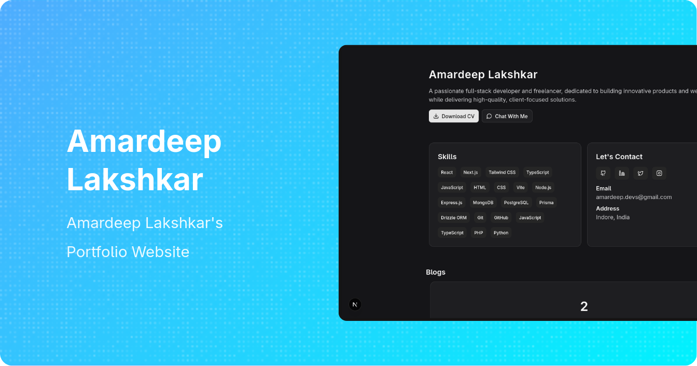

# Amardeep Lakshkar - Portfolio



## 🚀 Overview

Welcome to my professional portfolio repository! This is a modern, responsive web application built with Next.js and TypeScript that showcases my skills, projects, and professional experience as a full-stack developer.

Visit the live portfolio: [amardeep.space](https://amardeep.space)

## ✨ Features

- **Responsive Design**: Looks great on all devices from mobile to desktop
- **Dark/Light Mode**: Toggle between themes for comfortable viewing
- **Project Showcase**: Interactive cards displaying my featured projects
- **Skills Section**: Comprehensive list of my technical skills
- **Contact Information**: Easy ways to reach me through various platforms
- **Modern UI**: Built with Tailwind CSS and shadcn/ui components

## 🛠️ Tech Stack

- **Framework**: [Next.js 15](https://nextjs.org/) with App Router
- **Language**: [TypeScript](https://www.typescriptlang.org/)
- **Styling**: [Tailwind CSS](https://tailwindcss.com/)
- **UI Components**: Custom components with [shadcn/ui](https://ui.shadcn.com/) principles
- **Icons**: [Lucide React](https://lucide.dev/guide/packages/lucide-react)
- **Carousel**: [Embla Carousel](https://www.embla-carousel.com/)
- **Theme Switching**: [next-themes](https://github.com/pacocoursey/next-themes)
- **Deployment**: [Vercel](https://vercel.com/)

## 📂 Project Structure

```
portfolio/
├── app/                  # Next.js app directory
│   ├── layout.tsx        # Root layout component
│   ├── page.tsx          # Main portfolio page
│   └── globals.css       # Global styles
├── components/           # Reusable UI components
│   ├── ui/               # Base UI components
│   ├── ProjectCard.tsx   # Project display card
│   ├── Carousel.tsx      # Image carousel component
│   ├── Icons.tsx         # Custom icon components
│   └── ...
├── constants/            # Application constants
│   └── index.ts          # Skills, projects, and contact info
├── public/               # Static assets
│   └── media/            # Project images
└── ...
```

## 🚀 Getting Started

### Prerequisites

- Node.js 18.x or higher
- npm, yarn, or pnpm

### Installation

1. Clone the repository:
   ```bash
   git clone https://github.com/amardeeplakshkar/portfolio.git
   cd portfolio
   ```

2. Install dependencies:
   ```bash
   npm install
   # or
   yarn install
   # or
   pnpm install
   ```

3. Run the development server:
   ```bash
   npm run dev
   # or
   yarn dev
   # or
   pnpm dev
   ```

4. Open [http://localhost:3000](http://localhost:3000) in your browser to see the result.

## 🔧 Customization

To use this portfolio template for yourself:

1. Update the constants in `constants/index.ts` with your own information:
   - Skills
   - Projects
   - Contact information

2. Replace project images in the `public/media/` directory

3. Modify the main content in `app/page.tsx` to personalize your introduction

## 📱 Featured Projects

- **Ogify**: OG Image Generator for social media platforms
- **Veloci UI**: React Component Library for building modern UIs
- **Xenorai**: AI-powered chatbot with image and video generation
- **Live Emoji**: Animated Emoji Icon npm package

## 📞 Contact

- Email: [amardeep.devs@gmail.com](mailto:amardeep.devs@gmail.com)
- GitHub: [github.com/amardeeplakshkar](https://github.com/amardeeplakshkar)
- LinkedIn: [linkedin.com/in/amardeep-lakshkar-24a339244](https://in.linkedin.com/in/amardeep-lakshkar-24a339244)
- Twitter: [twitter.com/AmardeepDevs](https://x.com/AmardeepDevs)
- Instagram: [instagram.com/amardeep.webdev](https://instagram.com/amardeep.webdev)

## 📄 License

This project is open source and available under the [MIT License](LICENSE).

---

<p align="center">Designed & Developed with ❤️ by Amardeep Lakshkar</p>
